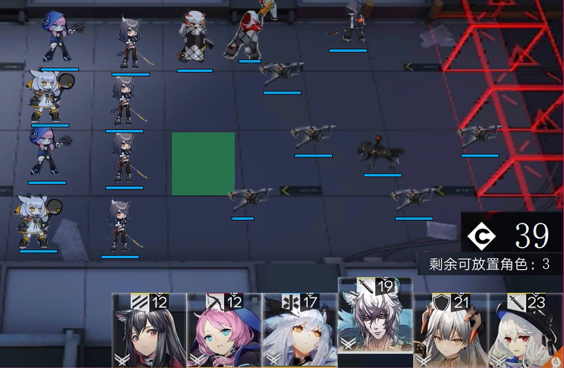

# Qt ArkNights

本项目实现一个简化版的明日方舟游戏。在玩法上，玩家需要在场地上布置干员，以抵挡来自屏幕右侧的敌方整合运动的攻击，防止其到达位于左侧边界的出口。玩家共有5点防御点数，每当有一名敌方到达出口时防御点数减1，当防御点数归0时游戏结束，以击杀的敌方数作为本次游戏的得分。

游戏画面截图：

#### 操作简介

游戏界面区域划分如下：

+ 记分牌：左侧的白色数字表示已击杀的敌方数量，右侧的红色数字表示剩余的防御点数

+ 战场：布置干员以及与敌方进行战斗的区域，敌方会从右侧的4个入口随机出现并沿当前行水平向左移动。战斗时根据攻击方攻击力与被攻击一方防御力的差值计算伤害，当攻击力小于等于防御力时造成极少量的伤害（10HP）

+ 干员选择：

  + 该区域右上方“C”字右侧的数字为当前持有总部署费用，最大值为99，只有部署费用小于总部署费用的干员才可以被部署，部署成功后，当前持有总部署费用扣除干员的部署费用。

  + 战场中一共可以布置12个干员，当剩余可放置角色为0时，无论持有多少部署费用都不可以再布置干员，除非干员被击败或通过双击干员主动撤退干员使得剩余可放置角色数增加。

  + 下方排列的是6种可选干员的图标，图标上方的数字代表该干员的部署费用。若要部署干员，则点击该干员对应的图标，此时图标升起，且将鼠标移动至战场区域时，会出现用绿色矩形表示的部署位置，将鼠标移动至想要部署的位置并单击左键即可布置干员。如图所示：

    

  

#### 干员图鉴

+ **德克萨斯**

  

  + 攻击：510
  + 防御：250
  + HP：1400
  + 部署费用：12
  + 阻挡数：2
  + 攻击范围：前方与自己近身的敌人
  + 特殊能力：先锋，部署后每隔一定时间会自动回复12点总部署费用，并在主动撤退时返还6点费用

+ **蓝毒**

  

  + 攻击：590（且攻速快）

  + 防御：100

  + HP：1000

  + 部署费用：12

  + 阻挡数：1

  + 攻击范围：$4 \times 3$（如图所示）

    

  + 特殊能力：优先攻击无人机，当不存在无人机时优先攻击攻击范围内最左侧的敌人

+ **白面鸮**

  

  + 回复力：300

  + 防御：150

  + HP：1200

  + 部署费用：17

  + 阻挡数：1

  + 回复范围：$4 \times 3$（如图所示）

    

  + 特殊能力：为攻击范围内的全体受伤干员回复HP

+ **银灰**

  

  + 攻击：750
  + 防御：400
  + HP：2200
  + 部署费用：19
  + 阻挡数：2
  + 攻击范围：前方与自己近身的敌人

+ **塞雷娅**

  

  + 攻击：400
  + 防御：600
  + HP：3000
  + 部署费用：21
  + 阻挡数：3
  + 攻击范围：前方与自己近身的敌人

+ **幽灵鲨**

  

  + 攻击：500
  + 防御：300
  + HP：2000
  + 部署费用：23
  + 阻挡数：3
  + 攻击范围：前方与自己近身的敌人
  + 特殊能力：对自己阻挡的所有敌人造成伤害

#### 敌方图鉴

+ **暴徒**

  

  + 攻击：300
  + 防御：400
  + HP：1000
  + 速度：正常
  + 出现频率：高
  + 出现时机：初始

+ **猎犬**

  

  + 攻击：200
  + 防御：200
  + HP：1000
  + 速度：快
  + 出现频率：高
  + 出现时机：初始

+ **无人机**

  

  + 攻击：0（不攻击）
  + 防御：100
  + HP：1200
  + 速度：正常
  + 出现频率：中等
  + 出现时机：开始游戏8秒后
  + 特殊能力：不会被阻挡，也不会被除蓝毒之外的干员攻击

+ **屠夫**

  

  + 攻击：700
  + 防御：400
  + HP：5000
  + 速度：正常
  + 出现频率：低
  + 出现时机；开始游戏30秒后

+ **欺凌者**

  

  + 攻击：500
  + 防御：400
  + HP：5000
  + 速度：正常
  + 出现频率：低
  + 出现时机：开始游戏45秒后
  + 特殊能力：巨大的身躯势不可挡，阻挡他相当于阻挡3名敌人，而阻挡数低于3的干员无法阻止其冲破防线
